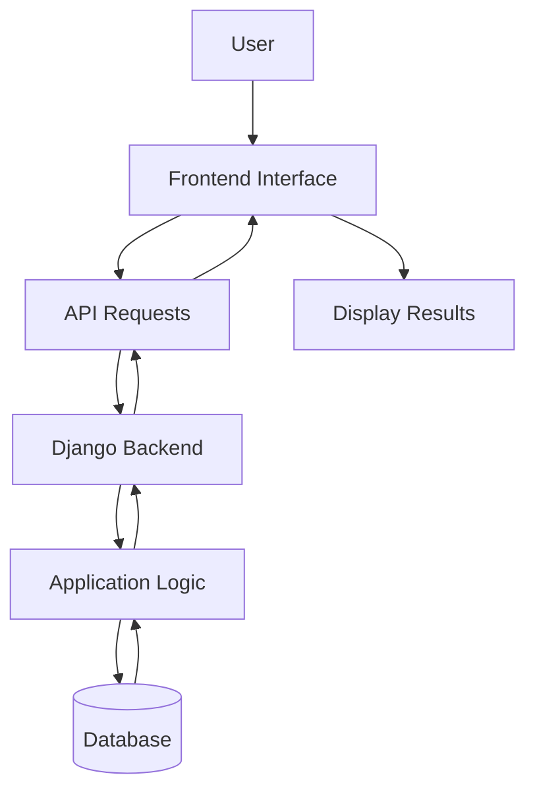

# 🚀 GenQuery AI

### Intelligent Query Processing with a Full-Stack Web Application

GenQuery AI is a full-stack project built with a frontend, Django backend, APIs, and database integration. It demonstrates how a web interface communicates with backend services to process requests and manage data.

<!-- PROJECT BANNER -->
<p align="center">

</p>
<p align="center">
  <b>Building smarter interactions through full-stack development.</b>
</p>

<p align="center">
  
  
  
  
</p>

---

## 📌 Table of Contents

- [Overview](#-overview)
- [Project Objectives](#-project-objectives)
- [Key Components](#-key-components)
- [System Architecture](#-system-architecture)
- [Screenshots](#-screenshots)
- [Technology Stack](#-technology-stack)
- [Getting Started](#-getting-started)
- [API Documentation](#-api-documentation)
- [Future Improvements](#-future-improvements)
- [Author](#-author)

---

## 💡 Overview

GenQuery AI is a full-stack web development project that combines frontend development with a Django backend and API integration.

The project focuses on connecting user interactions on the frontend with backend logic through API requests, with a database supporting data storage where configured.

The application is currently intended to be run and tested locally.

## 🎯 Project Objectives

- Build a structured frontend and backend application.
- Develop backend endpoints using Django.
- Enable communication between the frontend and backend through APIs.
- Integrate database functionality.
- Understand the complete workflow of full-stack application development.

## ✨ Key Components

### 🎨 Frontend
Provides the user interface through which users interact with the application.

### ⚙️ Django Backend
Handles server-side logic and processes incoming requests.

### 🔗 API Integration
Connects the frontend to backend endpoints and enables data exchange.

### 🗄️ Database
Supports data storage and retrieval according to the application's implementation.

---

## 🏗️ System Architecture



The frontend sends requests to Django APIs. The backend processes requests, interacts with the database when required, and returns responses to the frontend.

---

## 📸 Screenshots


### 🏠 Application Homepage


### 🖥️ Main Application Interface


### 🔌 API Response


## 🛠️ Technology Stack

| Component | Technology |
|---|---|
| Backend | Python, Django |
| API Layer | Project's configured API endpoints |
| Frontend | Add your actual frontend technology |
| Database | Add your actual database |
| Version Control | Git and GitHub |

---

## 🚀 Getting Started

Follow these steps to run the project locally.

### 1. Clone the Repository

```bash
git clone https://github.com/shaiksa123786-dot/GenQuery-AI.git
cd GenQuery-AI
```

### 2. Create a Virtual Environment

```bash
python -m venv venv
```

Activate it on Windows:

```bash
venv\Scripts\activate
```

### 3. Install Dependencies

If your backend contains a `requirements.txt` file:

```bash
pip install -r requirements.txt
```

### 4. Configure Environment Variables

Create a `.env` file if your project uses environment variables.

Configure the required database credentials, secret keys, and API settings. Never commit real secrets to GitHub.

### 5. Apply Database Migrations

From the directory containing `manage.py`, run:

```bash
python manage.py migrate
```

### 6. Start the Django Server

```bash
python manage.py runserver
```

Open the local development address:

```text
http://127.0.0.1:8000/
```

> Follow your project's actual dependency, database, and frontend setup instructions if they differ from these examples.

---

## 🔗 API Documentation

GenQuery AI includes backend APIs developed as part of the project.

The API base address during local development is generally:

```text
http://127.0.0.1:8000/
```

Add your actual endpoints below:

| Endpoint | Method | Purpose |
|---|---|---|
| `/your-endpoint/` | GET / POST | Describe its purpose |

Replace the example row with your real API routes, HTTP methods, and request/response details.

---

## 🔮 Future Improvements

- Improve application testing and error handling.
- Enhance the user interface and responsiveness.
- Add API documentation and validation.
- Improve security and configuration management.
- Deploy the application when ready.

---

## 👩‍💻 Author

**Salma Shaik**

AI & Machine Learning Engineering Student | Full-Stack Project Developer

🔗 GitHub: [shaiksa123786-dot](https://github.com/shaiksa123786-dot)

---

<p align="center">
  ⭐ If you find this project interesting, consider starring the repository!
</p>
